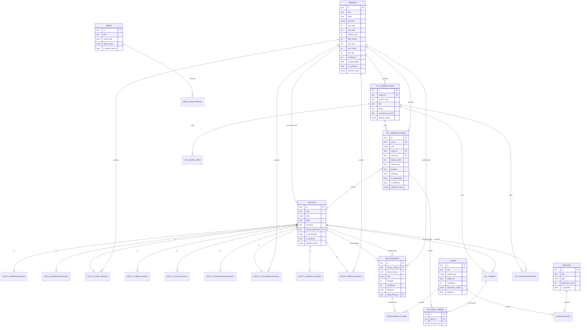

# Database Schema Overview

Drizzle ORM schema, PGlite (embedded Postgres-compatible), 36 tables.
Cycle 3 established 22, Cycle 6 added 2, Cycle 8A added 12 (5 canonical graph
extensions + 7 research staging). Source of truth: `src/db/schema/*.ts`. Migrations: `drizzle/*.sql`.

- Cycle 3 established the base schema (22 tables).
- Cycle 6 (issue #14, migration `drizzle/0001_*.sql`) added the Year-on-Line
  local-timeline tables (`yol_timeline_points`, `yol_point_themes`),
  sub-year integer date parts on `periods`, and the
  `entity_theme_details.lens_key` / `yol_themes.display_label` presentation
  bridges. The database is now the primary source for the rendered YoL
  (`GET /api/yol/[anchorSlug]` via `src/db/queries/yol-read-model.ts`); the
  `src/data/yol` TypeScript registry survives only as the isolated fallback.
  The staged research pipeline that will populate these tables is described
  in [`research-handoff.md`](./research-handoff.md).

## Conventions

- Primary keys: `text` UUIDs generated app-side (`newId()`, `crypto.randomUUID`).
- Confidence and strength: integer **0..100** (not 0..1) everywhere, enforced
  by CHECK constraints. See `data-integrity-rules.md`.
- Historical years: signed integers, astronomical year numbering
  (`-9999` = 10,000 BCE, matches `src/data/anchors.ts`'s `Anchor.year`).
  Never `Date` for historical years.
- `isPlaceholder` / `isSynthetic` flags + `editorialStatus` enum
  (`draft|in_review|verified|disputed|published|archived`) on every content
  table, so placeholder/synthetic data is always distinguishable from real
  research (there is none yet in this cycle).

## Tables by concern

- **Time** — `periods` (now with optional sub-year integer date parts —
  `start_month`/`start_day`/`end_month`/`end_day`, CHECK-constrained to
  1..12 / 1..31, BCE-safe, never JS `Date`).
- **Entities** — `entities` (shared columns: slug, kind, label, summary,
  editorial/placeholder/synthetic flags, primaryPeriodId) + one subtype
  table per kind: `entity_person_details`, `entity_invention_details`,
  `entity_event_details`, `entity_theme_details`, `entity_place_details`,
  `entity_organisation_details`, `entity_civilisation_details`,
  `entity_concept_details`, `entity_period_details`. `entity_theme_details`
  carries a `lens_key` bridge to the renderer's normalised theme keys.
- **Relationships** — `relationships`, `relationship_claims` (join to claims).
- **Claims & sources** — `claims`, `sources`, `claim_sources` (join, with
  quotation/locator).
- **Year on Line** — `yol_compositions`, `yol_themes` (now with an optional
  `display_label`), `yol_scene_hints`, `yol_featured_entities`, and the
  Cycle-6 local-timeline pair: `yol_timeline_points` (one ordered point per
  station — `role` ∈ overview/development/context/closing, `display_order`,
  optional `entity_id`/`period_id`, `section_key`, copy overrides,
  placeholder/synthetic/editorial flags) and `yol_point_themes` (join from a
  point to the year's `yol_themes`, i.e. its lens tags). Both cascade-delete
  with their composition; a point's `entity_id`/`period_id` are
  delete-restricted.
- **Media** — `media`, `media_associations` (polymorphic: entity/period/yol).

## Adding a new entity kind or relationship type

1. Entity kind: add the value to `entityKindEnum` in `schema/shared.ts`, add
   a subtype table in `schema/entity-subtypes.ts` if it needs kind-specific
   columns, add the value to `entityKindValues` in `validation/entity.ts`,
   run `npm run db:generate`, commit the new migration.
2. Relationship type: add the value to `relationshipTypeEnum` in
   `schema/shared.ts` and `relationshipTypeValues` in
   `validation/relationship.ts`. Decide if it should be acyclic — if so, add
   it to `ACYCLIC_EXPECTED_RELATIONSHIP_TYPES` in `schema/shared.ts` (used by
   the integrity audit). Run `npm run db:generate`.

## ER Diagram

Note: `claims.subjectId` and `media_associations.subjectId` are polymorphic
references (entity/relationship/period, or entity/period/yol_composition
respectively) — not real FK columns, so they're not drawn as FK edges above.
The integrity audit (`npm run db:audit`) checks they resolve to a real row.

## Cycle 8A additions (issue #5, migration 0002)

Cycle 8A evolves the foundation (it does not replace it) for the research
staging pipeline. Three concerns stay strictly separated: research staging,
private canonical graph, and public/editorial (`yol_*`, never written by
research). See `docs/research-operations.md` and
`instruction-set/backend-crm-opus-handover.md`.

### Canonical graph extensions

- **`entity_aliases`** — aliases/historical names/spellings/abbreviations/
  translations, with a `normalized` match column.
- **`entity_external_ids`** — Wikipedia/Wikidata/VIAF/… identifiers; a scheme+
  value resolves to exactly one entity (strongest, non-fuzzy match signal).
- **`entity_classifications`** — controlled richer vocabulary
  (`CLASSIFICATION_VOCABULARY`) that resolves the kind drift without growing
  the renderer `entities.kind` enum (`idea→concept`, `discovery→event`,
  plus document/work/law/treaty/technology/movement/…).
- **`entity_time_associations`** — typed multi-role entity↔period milestones
  (conceived/patented/demonstrated/commercialised/adopted/declined/replaced…);
  keeps `entities.primaryPeriodId` for renderer compatibility. Evidence via
  `claims.subjectType='time_association'`.
- **`relationship_type_registry`** — controlled, growable relationship types
  (inverse wording, directionality, allowed source/target kinds, cycle
  policy). `relationships.typeKey` FK-references it; the legacy `type` enum is
  now nullable (backfilled; 13 builtins seeded). New columns on
  `relationships`: `typeKey`, `assertionClass`, `contextPlaceId`.
- Additive columns: `claims.assertionClass`, `entities.graphStatus /
  freshnessCheckedAt / supersededById / mergedIntoId / revision`. New enum
  value `claim_subject_type='time_association'`.

### Research staging (never public)

`research_runs`, `research_jobs`, `research_packages` (with an immutable
`envelope` JSON snapshot + `submissionHash` for idempotency),
`research_package_items` (normalized, section-tagged, `held`/`decision`
per-item), `qa_results`, `qa_flags`, `package_decisions`.

### Adding types the scalable way

- **Relationship type:** INSERT a row into `relationship_type_registry`
  (data, no code migration). The audit flags an unregistered `typeKey`.
- **Classification:** add to `CLASSIFICATION_VOCABULARY` in
  `validation/graph-ext.ts` (no DB enum change).

### New integrity audit checks (`npm run db:audit`)

- `unknown_relationship_type_key` — a `typeKey` not in the registry (error);
- `assertion_class_violation` — a `verified`/`corroborated` claim whose
  assertion class is `inference`/`forecast` (error).
