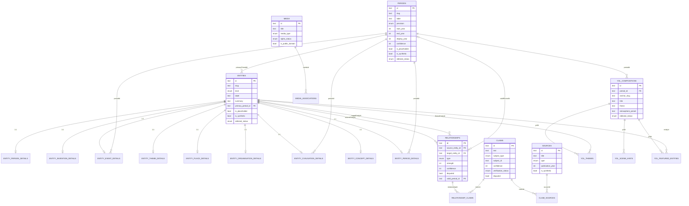

# Database Schema Overview (Cycle 3)

Drizzle ORM schema, PGlite (embedded Postgres-compatible), 22 tables across
8 concerns. Source of truth: `src/db/schema/*.ts`. Migrations: `drizzle/*.sql`.

## Conventions

- Primary keys: `text` UUIDs generated app-side (`newId()`, `crypto.randomUUID`).
- Confidence and strength: integer **0..100** (not 0..1) everywhere, enforced
  by CHECK constraints. See `data-integrity-rules.md`.
- Historical years: signed integers, astronomical year numbering
  (`-9999` = 10,000 BCE, matches `src/data/anchors.ts`'s `Anchor.year`).
  Never `Date` for historical years.
- `isPlaceholder` / `isSynthetic` flags + `editorialStatus` enum
  (`draft|in_review|verified|disputed|published|archived`) on every content
  table, so placeholder/synthetic data is always distinguishable from real
  research (there is none yet in this cycle).

## Tables by concern

- **Time** — `periods`
- **Entities** — `entities` (shared columns: slug, kind, label, summary,
  editorial/placeholder/synthetic flags, primaryPeriodId) + one subtype
  table per kind: `entity_person_details`, `entity_invention_details`,
  `entity_event_details`, `entity_theme_details`, `entity_place_details`,
  `entity_organisation_details`, `entity_civilisation_details`,
  `entity_concept_details`, `entity_period_details`.
- **Relationships** — `relationships`, `relationship_claims` (join to claims).
- **Claims & sources** — `claims`, `sources`, `claim_sources` (join, with
  quotation/locator).
- **Year on Line** — `yol_compositions`, `yol_themes`, `yol_scene_hints`,
  `yol_featured_entities`.
- **Media** — `media`, `media_associations` (polymorphic: entity/period/yol).

## Adding a new entity kind or relationship type

1. Entity kind: add the value to `entityKindEnum` in `schema/shared.ts`, add
   a subtype table in `schema/entity-subtypes.ts` if it needs kind-specific
   columns, add the value to `entityKindValues` in `validation/entity.ts`,
   run `npm run db:generate`, commit the new migration.
2. Relationship type: add the value to `relationshipTypeEnum` in
   `schema/shared.ts` and `relationshipTypeValues` in
   `validation/relationship.ts`. Decide if it should be acyclic — if so, add
   it to `ACYCLIC_EXPECTED_RELATIONSHIP_TYPES` in `schema/shared.ts` (used by
   the integrity audit). Run `npm run db:generate`.

## ER Diagram

Note: `claims.subjectId` and `media_associations.subjectId` are polymorphic
references (entity/relationship/period, or entity/period/yol_composition
respectively) — not real FK columns, so they're not drawn as FK edges above.
The integrity audit (`npm run db:audit`) checks they resolve to a real row.
